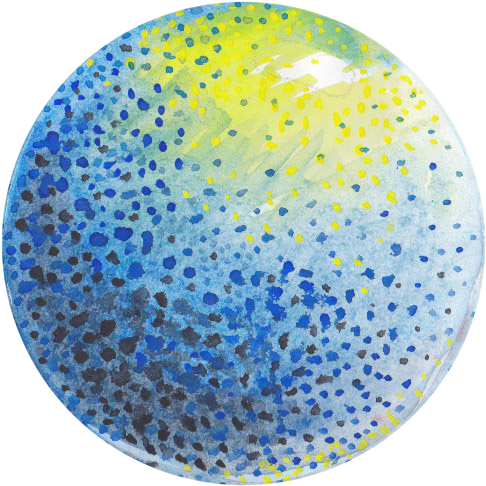
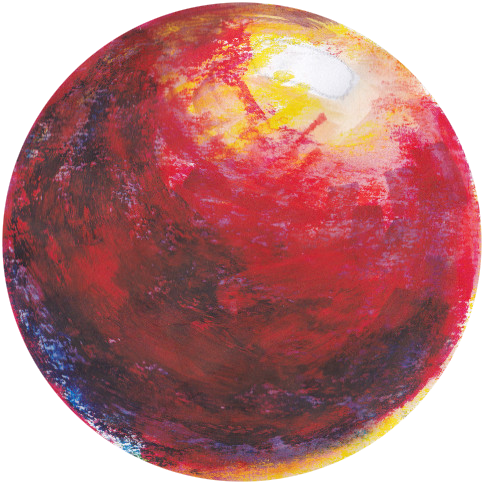
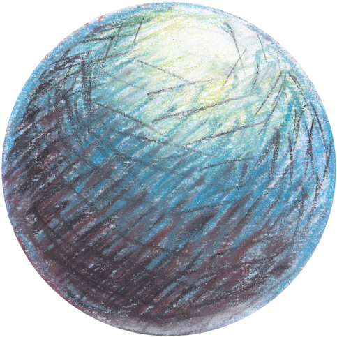
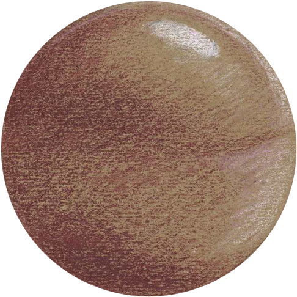
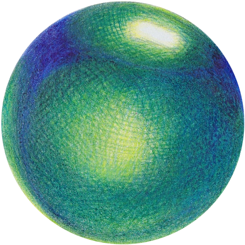
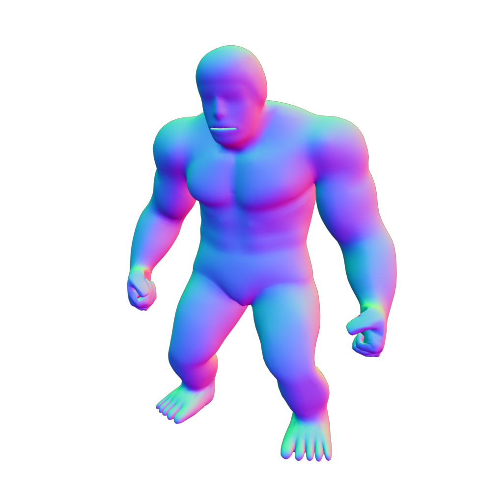
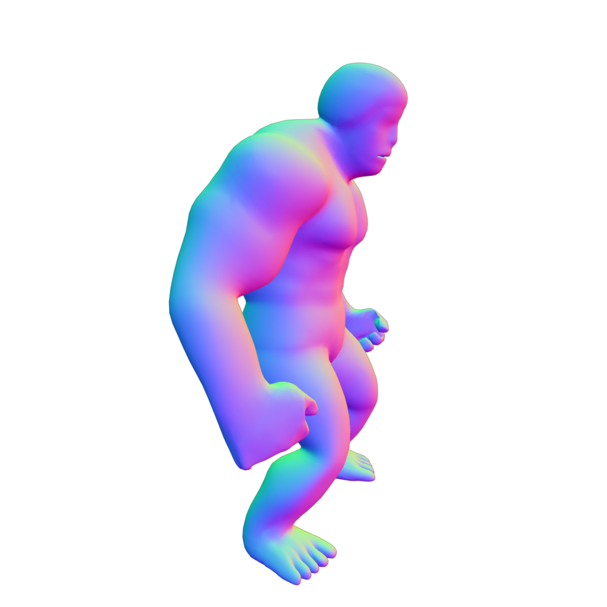
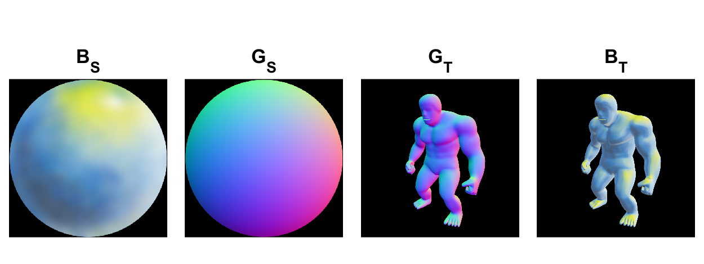

Cluster-Based StyleBilt Demo (MATLAB)
====

Simple MATLAB test-implementation of StyleBilt [\[Sýkora et al. 2019\]](https://dcgi.fel.cvut.cz/home/sykorad/styleblit.html).

The original work used **grid**-based approach to fit fully parallel operations on 3D rendering pipeline.

In this demo, I implemented **cluster**-based approach, which can be easily developed using MATLAB built-in functions. I just tested a single-scale StyleBilt process based on the cluster structures. However, overall quality seems good for processing animated sequences.

## Data

### Style

I tested the following 5 style images in [styles](styles).

Please see the core functions:
- [load_style](core/load_style.m)

01  | 02  | 03  | 04  | 05
--|---|---|---|--
  |    |    |    | 

### Target

I rendered 60 frames for target guide images (normal) [input](input).

Please see the core functions:
- [load_target](core/load_target.m)

001  | 015  | 030  | 045  | 060
--|---|---|---|--
   |    |    |    |  

## Results

You can make StyleBilt with the following quality.

<video src="results/stylebilt_01.mp4" autoplay></video>

## Mechanism

### Base Layer Transfer

Following the original work, I implemented base layer transfer using Lit-Sphere.

Please see the core functions:
- [separate_base_detail](core/separate_base_detail.m)
- [base_transfer](core/base_transfer.m)




### Cluster-Based Detail Layer Transfer

I replaced the original jittering grid-based approach with cluster-based approach. I simply clusters coupled (guide, position) feature to make near regular cluster regions.

Please see the core functions:
- [stylebilt_cluster](core/stylebilt_cluster.m)


## Installation

Before running demo programs, please run the following command once from the command window (or just run [stylebilt_setup.m](stylebilt_setup.m)).

``` bash
  >> stylebilt_setup
```

This command just adds [`core`](core) and [`demo`](demo) directories to MATLAB path to run the example scripts in the root directory.

*Note*: This program was only tested on **Windows 10** with MATLAB R2017b. **Linux** and **Mac OS** are not tested, CPU computation may work for the environments.

## Dependencies

I used functions from the following toolboxes.

- Image Processing Toolbox
- Statistics and Machine Learning Toolbox

## Example Codes

### Cluster-Based StyleBilt Demo on Video Inputs: [run_stylebilt_video.m](run_stylebilt_video.m)

You can test the main demo code in the following.

``` MATLAB
%% Cluster-Based StyleBilt Demo on Video Inputs

%% Parameter settings
sigma = 15;

k = 200;
density = 1.5;

%% Run Cluster-based StyleBilt demo on video inputs for each style_id ['01', ..., '05']
for id=1:5
    style_id = sprintf('%02d', id);
    stylebilt_video_demo(style_id,sigma, k, density);
end

```

This code will generate video results for 60 target frames with 5 styles through the cluster-based StyleBilt process (it may take 30 min to complete the process).

Please see the demo functions:
- [stylebilt_video_demo](demo/stylebilt_video_demo.m)

Parameter  |  Description
--|--
style_id  |  style id ['01', ..., '05']
sigma  |  Gaussian filter parameter for base/detail layer separation
k  |  target number of clusters
density  |  density of sampling exempler

### Cluster-Based StyleBilt Demo: [run_stylebilt.m](run_stylebilt.m)

You can test cluster-based stylebilt function in the following way.

``` MATLAB
%% Cluster-Based StyleBilt Demo

%% Parameter settings
sigma = 15;
target_frame = 1;

k = 200;
density = 1.5;

%% Run Cluster-based StyleBilt demo for each style_id ['01', ..., '05']
for id=1:5
    style_id = sprintf('%02d', id);
    stylebilt_demo(style_id, target_frame, sigma, k, density);
end

```

This code will generate StyleBilt results with 5 styles including base layer transfer and cluster-based detail layer transfer.

Please see the demo functions:
- [stylebilt_demo](demo/stylebilt_demo.m)

Parameter  |  Description
--|--
style_id  |  style id ['01', ..., '05']
target_frame  |  target frame number [1, ..., 60]
sigma  |  Gaussian filter parameter for base/detail layer separation
k  |  target number of clusters
density  |  density of sampling exempler

### Base Layer Transfer Demo: [run_base_transfer.m](run_base_transfer.m)

You can test base layer transfer function in the following way.

``` MATLAB
%% Base Layer Transfer Demo

%% Parameter settings
sigma = 15;
target_frame = 1;

%% Run base layer transfer demo for each style_id ['01', ..., '05']
for id=1:5
    style_id = sprintf('%02d', id);
    base_transfer_demo(style_id,target_frame, sigma);
end
```

Please see the demo functions:
- [base_transfer_demo](demo/base_transfer_demo.m)

Parameter  |  Description
--|--
style_id  |  style id ['01', ..., '05']
target_frame  |  target frame number [1, ..., 60]
sigma  |  Gaussian filter parameter for base/detail layer separation

## Performance

Process | Computation time
--|--
base transfer |  2.27 sec
detail transfer  |  5.94 sec
total   |  8.25 sec

## Limitations

Due to the unoptimized code, main drawback is its performance (it takes about 10 sec to process a single target image).

Quality might be also improved by multi-scale StyleBilt approach taken in the original work. I consider to extend the current single-scale clustering using a hierarchical manner.  


## License

The MIT License 2019 (c) tody
